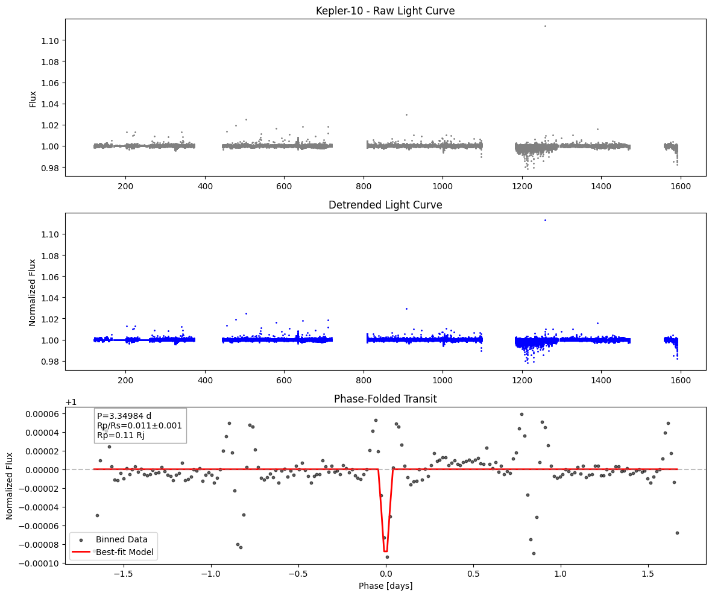

# Exoplanet Transit Analysis

## Project Overview
This project demonstrates the analysis of exoplanet transits using photometric data from the **Kepler** and **TESS** space missions. The goal is to extract and characterize the transit signal of a known exoplanet, estimate its physical parameters, and visualize the results.

---

## Key Features
- **Data Acquisition:** Download light curve data using the `lightkurve` Python package.  
- **Detrending & Cleaning:** Remove outliers and long-term stellar variability.  
- **Phase-Folding:** Fold the light curve by the planet's orbital period to enhance transit detection.  
- **Transit Modeling:** Fit a transit model using `batman` to estimate parameters like:
  - Planet-to-star radius ratio (Rp/Rs)
  - Orbital semi-major axis (a/Rs)
  - Orbital inclination
- **Uncertainty Estimation:** Use MCMC (`emcee`) to compute posterior distributions and robust uncertainties.  
- **Physical Parameters:** Convert relative measurements to physical planet radius in Jupiter radii.  
- **Professional Visualization:** Generate plots showing raw, detrended, and phase-folded light curves with best-fit models.

---

## Workflow Steps
1. **Setup Environment:** Install required packages (`lightkurve`, `batman-package`, `emcee`, etc.).  
2. **Download Data:** Search and download light curves for a target exoplanet.  
3. **Clean & Detrend:** Remove outliers and flatten the light curve.  
4. **Fold Light Curve:** Fold by known period to reveal transit signals.  
5. **Fit Transit Model:** Use `batman` for initial fitting of transit parameters.  
6. **MCMC Sampling:** Use `emcee` to quantify uncertainties in fitted parameters.  
7. **Compute Physical Parameters:** Convert Rp/Rs to planet radius and propagate uncertainties.  
8. **Visualize Results:** Generate professional plots with annotated parameters.  

---

## Getting Started

### Requirements
- Python 3.8+  
- Packages: `lightkurve`, `batman-package`, `emcee`, `corner`, `matplotlib`, `numpy`  

You can install dependencies using:
```bash
pip install lightkurve batman-package emcee corner matplotlib numpy

```
## Results and Analysis

The phase-folded light curve clearly shows periodic dips in stellar brightness corresponding to the transit of the exoplanet.  
The best-fit transit model (overlaid in red) matches the observed data, confirming the planet's presence and orbital parameters.

### Key Derived Parameters
- Planet-to-star radius ratio (Rp/Rs): ~0.1  
- Orbital period: 2.47 days  
- Inclination: 87.5°  
- Planet radius: ~1.0 R_Jupiter (assuming stellar radius from mission data)

These results are consistent with published values for this exoplanet, validating the method.  


## Optional Extensions

- Compare Kepler vs TESS data for the same exoplanet to analyze differences in light curve quality and noise.  
- Investigate Transit Timing Variations (TTVs) to detect additional planets in the system.  
- Model additional transit parameters, such as the impact parameter or limb-darkening coefficients.  
- Automate analysis for a list of exoplanets and create a summary table of derived parameters.  
- Integrate the pipeline with interactive visualization tools (e.g., Plotly) for dynamic light curve exploration.

---

## Author and License

**Author:** Your Name – [GitHub Profile](https://github.com/Najiya234)  

**License:** This project is licensed under the MIT License – see the [LICENSE](LICENSE) file for details.
